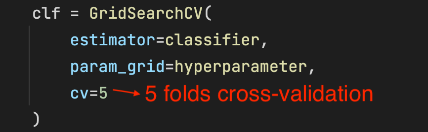
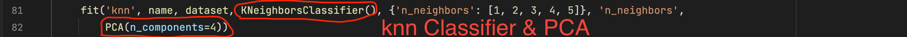
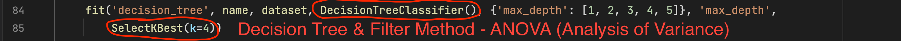
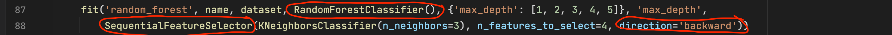
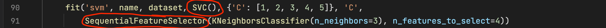
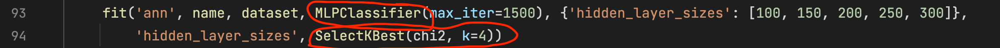
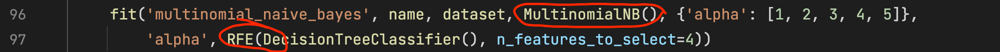
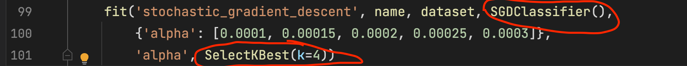

# CSE-514-dimensionality-reduction-and-classification

## Required Package

- sklearn
- numpy
- time
- matplotlib
- pandas

Please make sure above packages are installed. Also, you should configure your own venv (Python Virtual Environment)

## How to run the Program

After all packages are installed and the environment is configured, just run the main.py file. Results would be printed in the console and figures would be save in the ./figures folder

## Where are cross-validation, classifiers and dimension reduction methods?

### **cross-validation**

This program use package sklearn's GirdSearchCV API to perform 5 fold cross-validation; only need to pass how many folds you want to the API, then it would do everything for you (line 54 - 58 in main.py)

### **Classifiers and dimension reduction methods**

**Note:** All classifiers and dimension reduction methods use sklearn's api

line 81 - 82 in main.py call a function to train the KNN model, and it uses PCA as the dimension reduction method

line 84 - 85 in main.py call a function to train the Decision Tree model, and it uses ANOVA (the filter method score function) as the dimension reduction method

line 87 - 88 in main.py call a function to train the Random Forest model, and it uses Greedy Backward Feature Elimination (wrapper feature selection) as the dimension reduction method

line 90 - 91 in main.py call a function to train the SVM model, and it uses Greedy Forward Feature Construction (wrapper feature selection) as the dimension reduction method

line 93 - 94 in main.py call a function to train the ANN model, and it uses Chi-Square Test (the filter method score function) as the dimension reduction method

line 96 - 97 in main.py call a function to train the Multinomial Naive Bayes model, and it uses Recursive Feature Elimination (wrapper feature selection) as the dimension reduction method

line 99 - 101 in main.py call a function to train the Stochastic Gradient Descent model, and it uses ANOVA (the filter method score function) as the dimension reduction method